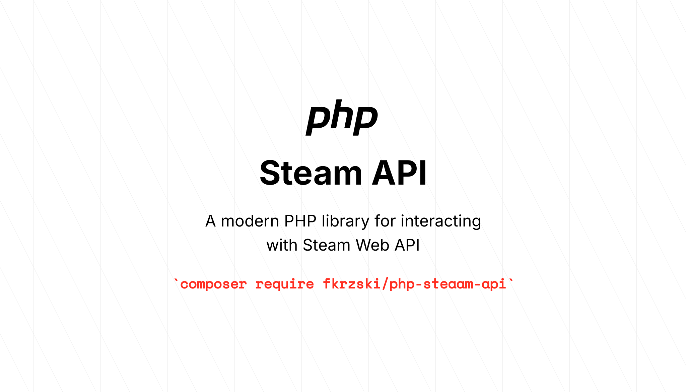

<p align="center">



</p>

------

## Fkrzski PHP Package Skeleton

This package provides a wonderful **PHP Package Skeleton** to start building your next PHP package, including:

- **PHP 8.3+** support
- **Pint** for code formatting
- **Rector** for refactoring
- **PHPStan** for static analysis
- **PEST** for unit testing
- **PEST plugin** for type coverage checks
- **GitHub Actions** for CI with conditional checks for less GH Actions minutes usage
- **.gitattributes** for ignoring unnecessary files while creating a project or installing via dependencies

## Usage

⚡️ Create your package using [Composer](https://getcomposer.org):

```bash
composer create-project fkrzski/php-package-skeleton PackageName
```

## Composer scripts

🧹 Keep a modern codebase with **Pint**:

```bash
composer lint
```

✅ Run refactors using **Rector**

```bash
composer rector
```

🧪 Run type coverage checks using **PEST plugin**:

```bash
composer test:type-coverage
```

⚗️ Run static analysis using **PHPStan**:

```bash
composer test:types
```

✅ Run unit tests with code coverage using **PEST**

```bash
composer test:unit
```

🚀 Run the entire test suite:

```bash
composer test
```

**PHP Package Skeleton** was created by **[Filip Krzyżanowski](https://linkedin.com/in/fkrzski)** under the *
*[MIT license](https://opensource.org/licenses/MIT)**.
